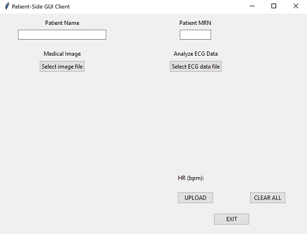
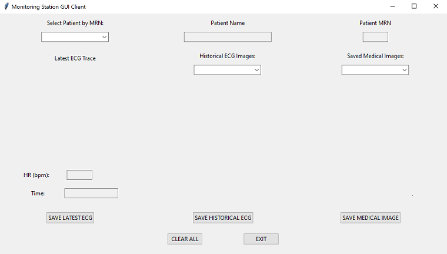

[](https://github.com/BME547-Fall2021/final-project-anuj-braden/blob/main/LICENSE.txt)


# BME 547 Final Project

## Authors: Braden Garrison and Anuj Som

## Due: 12/5/21

## Repository Purpose

This patient monitoring client/server project repository serves as a total Patient Monitoring 
System containing patient-side and monitoring station GUI client interactions through a server-accessed 
MongoDB patient database. From the patient-side GUI, users are able to upload patient names, medical record numbers (MRNs), 
locally-stored medical images, and ECG traces and heart rate data analyzed in real time from locally-stored 
ECG data files. From the monitoring station GUI, users are able to retrieve the uploaded patient data from the 
patient database via server access and save important medical and ECG images.

This server is running on a virtual machine with the following hostname and port:

```http://vcm-23156.vm.duke.edu:5000```

If the user decides to run this server locally, first activate the virtual environment containing the packages listed in 
```requirements.txt``` then type the following command into the command line:

```python ecg_server.py```

A video demo of these client programs in action can be found at this Duke Box link [here](https://duke.app.box.com/folder/151464609081).


## GUI Instruction Manual

### Patient-Side GUI



Upon patient-side GUI deployment, the above image is the starting interface the user will see.
The user has the option to manually enter the patient name and patient MRN.
The ```Select image file``` button can be pressed to select a medical image to display directly beneath the button on the GUI.
The ```Select ECG data file``` button can be pressed to select an Excel file of raw time and voltage ECG values to be analyzed.
Upon analysis, the resultant ECG trace will be displayed below the button, and the analyzed heart rate in beats per minute will 
be displayed next to the   
```HR (bpm):``` label. 

To clear all entered/analyzed data from the interface, the user can click the ```CLEAR ALL``` button. This will return the GUI to 
its original state.

To upload all entered/analyzed data to the patient MongoDB database, the user can click the ```UPLOAD``` button.   
**NOTE: A proper upload can only be completed if at least a medical record number has been entered.**

To shut down the program and exit the GUI, the user can click the ```EXIT``` button.


### Monitoring Station GUI



Upon monitoring station GUI deployment, the above image is the starting interface the user will see.
The user can select patients by their MRN from the patient database using the upper-left dropdown box.
This dropdown box is automatically synced to the database by short, periodic API requests that constantly keep it up to date 
with the latest patient info. 
Upon patient selection, the patient name and MRN will be displayed in their respective entry boxes. The latest ECG trace for that patient, 
along with the analyzed heart rate value and timestamp of that trace, will be displayed on the left-hand side of the interface. 
The user can then select from updated lists of historical ECG images and saved medical images from their respective dropdown boxes.
Upon selection, these images will be displayed on the GUI below their labels.   
**NOTE: Upon new patient selection, any displayed historical ECG and medical images will be deleted, and the new patient name, MRN, and latest ECG will be displayed.**

To save any of the displayed images locally, the user can click one of the following buttons: ```SAVE LATEST ECG```, ```SAVE HISTORICAL ECG```, 
or ```SAVE MEDICAL IMAGE```.

To clear all displayed patient info from the interface, the user can click the ```CLEAR ALL``` button.

To shut down the program and exit the GUI, the user can click the ```EXIT``` button.

## Server API Reference Guide

The ECG server is backend support for the Monitoring GUI and Patient-Side GUI systems and allows as an interface with information stored in the MongoDB Atlas Database. 
Server Routes:
### api/get_mrn
Accepts get request and returns list of existing MRNs within database. Calling this method will return a jsonify'd list of 
MRN integers within the database. If there are no patients in the database, the list will return empty.
### api/post_new_patient_info
Accepts json request and posts new patient information or updates patient information within database.
input json should contain a dict formatted as follows:
```python
{
    "MRN": int, str,          # can be an int or integer cast-able string
    "patient_name": str,      # Should be patient MRN
    "ECG_trace": str,         # Image info as b64_string
    "heart_rate": int, str,   # heart rate of above image, as int or integer cast-able string
    "medical_images": str     # Image info as b64_string
}
```

The only required field is "MRN". If an ECG trace is
uploaded, it must be accompanied by a heart_rate and
vice-versa, else an error will be thrown. Route will
save this information to the database by either
creating new entries or appending to existing lists.

Route will return error string and status code. 

### api/get_patient_from_database/{MRN}/{field}

Allows user to input MRN and field from patient they are interested in, and returns the information 
pulled from the database as specified by field. Valid field strings are: 

'MRN', 'patient_name', 'ECG_trace', 'heart_rate', 'receipt_timestamps', and 'medical_image'

This route will return the requested field from the patient information stored within the database. 

### api/clear_db/<Password>

Developer method which simply clears contents of MongoDB Database. Correct password is required (Password: BME547). 

To use, simply send get request to host/api/clear_db/<Password> to clear database contents.

## MongoDB Database Structure

The database for this project is hosted on a MongoDB Atlas cluster, hosted in AWS N. Virginia (us-east-1). 

The database holds collection patient, which has valid fields constructed in PyMODM as follows:

```python
'MRN' (primary key): fields.IntegerField(primary_key=True)
'patient_name': fields.CharField()
'ECG_trace': fields.ListField(fields.CharField())
'heart_rate': fields.ListField(fields.IntegerField())
'receipt_timestamps': fields.ListField(fields.CharField())
'medical_image': fields.ListField(fields.CharField())
```

It is noted that MRN is an integer field, however as it is the primary key it is referenced as _id.

The ListFields 'ECG_trace', 'heart_rate', and 'receipt_timestamps' are lists of the same length which store information
about index-specific ECG_traces, namely the trace image plot, trace heart rate, and timestamp the image was uploaded to the
database (as datetime format: "%Y-%m-%d %H:%M:%S").
